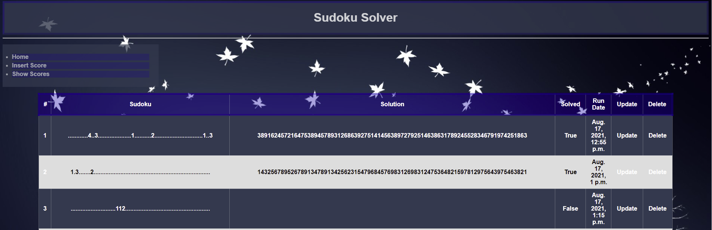

# DjangoSudoku
Sudoku Solver Web App in Django.

The solver uses solution space reduction on the input after filling all the empty cells with all possible values.
After the reduction, depth-first search is used recursively for backtracking using constraint satisfaction.
The solution is coded in "vanilla" Python without using any library.

Run the web server with: $cd Sudoku; python manage.py runserver.

## Home

## Solve

## Scores
Scores are saved in the database and can be updated/deleted/created.

